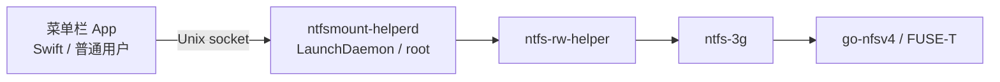

# NTFS 读写 · NTFSMount

[下载](https://github.com/bio-apple/NTFSMount/releases) · [English](./README_EN.md)

**不要用 GitHub Latest，不要镜像。** 只从 [Releases](https://github.com/bio-apple/NTFSMount/releases) 下载标成 pre-release 的 `NTFSMount.dmg`，并用正文中的 SHA256 校验。

**分发范围：仅个人使用，不是可公开再分发的产品。** 捆绑的 FUSE-T `go-nfsv4` 不是 GPL；在取得 [FUSE-T](https://www.fuse-t.org/) **书面许可** 并完成 Developer ID 公证之前，禁止当产品上架、销售或第三方镜像。源码（Swift / ntfs-3g）仍按 GPL-2.0-or-later 提供。见 [NOTICE](./NOTICE)。

**免责声明。** 以可写方式挂载或格式化 NTFS 可能损坏或丢失数据。操作前请自行备份重要文件。作者与本项目不对数据损失负责。

Mac 上给**外置 NTFS 盘**可写访问，不用内核扩展。仅 **Apple Silicon + macOS 13+**，不支持 Intel。

## 使用

1. 下载 DMG，校验：`shasum -a 256 NTFSMount.dmg`（须与 Release 正文一致）。
2. 拖入「应用程序」。若拦截：Control-click → 打开，或「系统设置 → 隐私与安全性」→ 仍要打开。仍无法打开：
   ```bash
   xattr -d com.apple.quarantine /Applications/NTFSMount.app
   ```
3. 打开后回车是 **同意并继续**（Esc 为退出）；再在窗口点 **安装…**（要管理员密码）。
4. 插入外置 NTFS，用访达读写。用完 **推出（可安全拔出）**（会先释放 FUSE/ntfs-3g 挂载，避免访达提示正被占用），盘消失后再拔线。

菜单栏右边会出现 **NTFS**（见下图）。点子菜单即可挂载 / 卸载 / 推出，或 **打开窗口**。自动挂载和助手在 **设置**。内置盘不会自动挂。

```text
菜单栏「NTFS」
├ 打开窗口
├ 可写 · 盘名 · 容量     ← 每块 NTFS 一个子菜单
│   ├ 以可写方式挂载
│   ├ 在访达中打开
│   ├ 卸载 / 推出（可安全拔出）
│   └ 格式化为 NTFS…
├ 全部以可写方式挂载
├ 刷新 / 设置…
└ 退出 NTFS 读写
```


| 状态 | 做什么 |
| --- | --- |
| 可写 | 直接用 |
| 只读 · 系统 NTFS | 卷干净时，子菜单里改成可写 |
| 只读 · 休眠/未正常关机 | 先在 Windows 彻底关机，不要强行可写 |

格式化只对外置整盘：输入当前卷名，回车默认 **取消**。  
卸载助手：设置里。完全卸载（应用、助手、LaunchDaemon 与配置）：`./uninstall.sh`（不删系统里另装的 FUSE-T / MacFUSE）。

## 故障排除

**打不开应用？** 未公证包会被隔离。先 Control-click → 打开；或「隐私与安全性」→ 仍要打开。仍不行：

```bash
xattr -d com.apple.quarantine /Applications/NTFSMount.app
open /Applications/NTFSMount.app
```

**菜单栏没有 NTFS？** 确认在 Apple Silicon + macOS 13+；看程序坞 / 打开窗口里是否被退出。用 `xattr` 清隔离后再开一次。

**一直只要管理员密码？** 未公证包无法稳定用 `SMAppService`，每次装助手都会要密码。这是预期。公证后才优先系统服务。

**盘是只读？** 「系统 NTFS」可在子菜单改可写（卷须干净）。「休眠/未正常关机」：若仅为脏卷，可点「尝试修复脏卷」（可能丢失未写入的 Windows 缓存，请先备份；默认取消）。若 Windows 休眠/快速启动（有 hiberfil），请彻底关机后再试，不要强行可写。

**找不到 Latest 资产？** 故意的。用 Releases 里的 pre-release DMG，不要用 Latest。

**Intel Mac？** 不支持。脚本会直接退出，请不要安装。

**提交 Bug？** 先跑只读诊断（不挂载、不要管理员密码、不装助手）：`./scripts/ntfsmount diagnose` 或 `./scripts/ntfsmount diagnose --json`。

**卸不干净？** `./uninstall.sh` 会删本应用、助手、LaunchDaemon 与配置。系统级 FUSE-T / MacFUSE 以及 `/usr/local/lib/libfuse.2.dylib` 需自行处理。

更多：[docs/MANUAL_TEST.md](./docs/MANUAL_TEST.md)。许可边界：[NOTICE](./NOTICE)、[docs/DISTRIBUTION.md](./docs/DISTRIBUTION.md)。

## 架构

挂载、卸载、格式化需要 root。菜单栏 App 保持普通用户权限，把这些操作交给一次性安装的 LaunchDaemon（设置里的「助手」）。之后不再弹管理员密码，也不写 `sudoers`。



| 组件 | 做什么 |
| --- | --- |
| App | 列卷、确认格式化、设置；经 socket 发 `mount` / `unmount` / `eject` / `format` |
| `ntfsmount-helperd` | 系统级守护进程；只用调用方 **CDHash + bundle id + 可执行路径** 钉扎，拒绝其它进程 |
| `ntfs-rw-helper` | 包内 bash；真正跑 `ntfs-3g` / `mkntfs`（仓库源码，不是第三方预编译） |
| ntfs-3g + FUSE-T | 用户态读写外置 NTFS，**不用 kext**。`go-nfsv4` 随应用捆绑 |

未公证包上 `SMAppService` 常失败，会改用管理员密码装同一个 Daemon。设置里「卸载助手」只去掉 Daemon；`./uninstall.sh` 会删应用、守护进程和配置。

## 开发

```bash
./scripts/prepare-runtime.sh   # 从 FUSE-T 官方 pkg / Homebrew 取二进制并校验 SHA256
swift test && ./scripts/test-helper.sh
./scripts/coverage.sh          # 可选：NTFSMountCore 行覆盖率
./scripts/ntfsmount diagnose           # 只读诊断（贴 Bug / CI 日志）；加 --json
./scripts/build.sh && ./scripts/package-dmg.sh
```

依赖：Homebrew + `brew install ntfs-3g`；**FUSE-T 1.2.7** 官方 pkg（[GitHub Releases](https://github.com/macos-fuse-t/fuse-t/releases/tag/1.2.7)，不是 Homebrew，专有软件不要 `brew install fuse-t`）。`prepare-runtime.sh` 缺 ntfs-3g 时会执行 `brew install`；**不会**把 FUSE-T 静默装进系统，缺本机文件则下载钉死的 1.2.7 pkg 并校验 SHA256。**不必启动 FUSE-T.app**。本机已装但不是 1.2.7 的 FUSE-T 会被拒绝。命令与查找路径见脚本输出；钉死版本 [runtime/versions.txt](./runtime/versions.txt)。

Intel Mac 上 `prepare-runtime.sh` / `build.sh` 会立刻退出，不要在 x86_64 上构建或安装。

PR 会跑 SwiftLint / UnitTest / Security Scan / Build（见 `.github/workflows/build.yml`）。真盘可选：手动触发 `.github/workflows/manual-disk-test.yml`（self-hosted Apple Silicon）。

[](https://github.com/bio-apple/NTFSMount) [](https://github.com/bio-apple/NTFSMount)

`Tests/NTFSMountCoreTests` 用 MockCatalog，不插真盘。2026-09-23，`swift test --enable-code-coverage`（11 个用例）。**不含** SwiftUI、**不含** `ntfs-rw-helper`（bash；由 `test-helper.sh` / `selftest` 覆盖）。`LiveDiskCatalog` 调 diskutil，行覆盖率 0%。

| 逻辑 | 文件 | 行覆盖 |
| --- | --- | --- |
| 磁盘检测 | `NTFSVolume.swift` | 74% |
| 格式化（谁能抹盘） | `FormatDisk.swift` | 69% |
| 格式化（精确卷名 / 默认取消） | `FormatPolicy.swift` | 91% |
| 挂载分类（脏盘 / 系统只读 / kext） | `VolumeHealth.swift` | 82% |
| NTFSMountCore 合计 | 上列 + 文案 / 错误映射 / Live I/O | 63% |
| 合计（排除 LiveDiskCatalog） | | 75% |

已知可用（详表 [runtime/versions.txt](./runtime/versions.txt)，哈希 [runtime/SHA256SUMS](./runtime/SHA256SUMS)）：

| 组件 | 版本 | 来源 |
| --- | --- | --- |
| FUSE-T | 1.2.7 | [GitHub Releases](https://github.com/macos-fuse-t/fuse-t/releases/tag/1.2.7) |
| go-nfsv4 | 1.2.7 | 上述 pkg 内 `go-nfsv4-1.2.7` |
| libfuse.2 | 2.9.9 | 同一 pkg |
| ntfs-3g / mkntfs / ntfsfix | 2026.7.7 | Homebrew `ntfs-3g` |

`runtime/` 里的大二进制不进 Git（`.gitignore`；误加则走 Git LFS）。

真盘步骤：[docs/MANUAL_TEST.md](./docs/MANUAL_TEST.md)。公证与分发：[docs/DISTRIBUTION.md](./docs/DISTRIBUTION.md)。

推送 `v*` tag 会走 GitHub Actions：自动打包 DMG 并创建 Release。配齐 Developer ID + App Store Connect API Key 才会公证；否则仍是未公证预发布。不要把 Latest 指到未授权包。

本仓库 Swift 与 ntfs-3g 为 GPL-2.0-or-later（[LICENSE](./LICENSE)）。`go-nfsv4` 不能按 GPL 再分发。

完整英文说明：[README_EN.md](./README_EN.md)。
