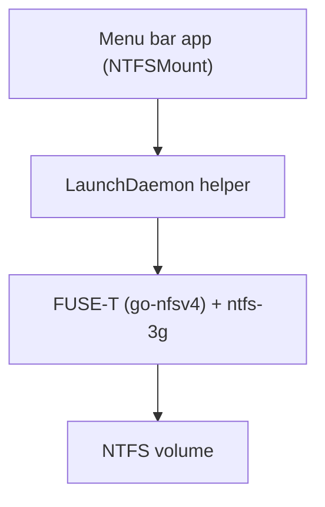
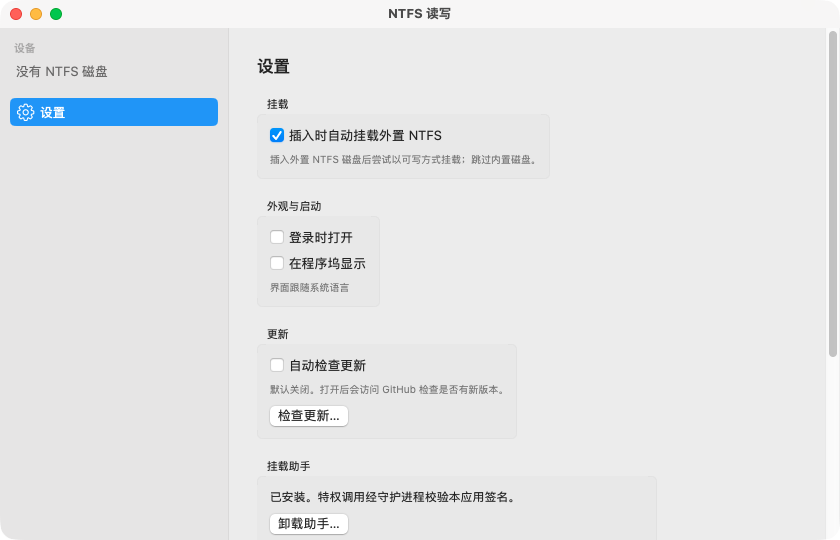

# NTFSMount

Menu-bar app for **read/write external NTFS** on Apple Silicon (macOS 13+). Userspace only — bundled FUSE-T (`go-nfsv4`) + ntfs-3g, no kernel extensions, **SIP stays on**.

> ⚠️ **Personal use only · not notarized.** Writing or formatting an NTFS volume can destroy data — back up first. Gatekeeper blocks first launch; you must allow the app manually. Bundled FUSE-T `go-nfsv4` is not GPL — do not redistribute or sell.

**[Download PKG](https://github.com/bio-apple/NTFSMount/releases/latest/download/NTFSMount.pkg)** · [Releases / SHA256](https://github.com/bio-apple/NTFSMount/releases/latest) · Current: **1.0**

Download updates from GitHub Releases. The in-app Sparkle updater is hidden on this unnotarized build and is not the download path.

**Requirements:** Apple Silicon (arm64), macOS 13+, SIP enabled. Install under `/Applications`. Not for Intel Macs, the Mac App Store, or official Homebrew. Do not `brew install` macFUSE, FUSE-T, or ntfs-3g — the app ships its own runtime and does not search Homebrew prefixes.

## Quick Start

1. Download the package from GitHub Latest and open it. The installer puts **NTFSMount** in Applications and installs the mount helper (the installer's administrator password, once). This installs a LaunchDaemon — not sudoers NOPASSWD.
2. Control-click the app → **Open**, or System Settings → Privacy & Security → **Open Anyway**.
3. Agree.
4. Plug in an external NTFS disk → menu bar **NTFS** → **Mount Writable**.

## Architecture

```mermaid
flowchart TB
    A["Menu bar app (NTFSMount)"]
    B["LaunchDaemon helper"]
    C["FUSE-T (go-nfsv4) + ntfs-3g"]
    D["NTFS volume"]
    A --> B
    B --> C
    C --> D
```

## Screenshots

<table>
<tr>
<td align="center" valign="top" width="33%"> Menu bar</td>
<td align="center" valign="top" width="33%"> Window</td>
<td align="center" valign="top" width="33%"> Settings</td>
</tr>
</table>

## Uninstall

1. Open the app → Settings → Remove Helper.
2. Drag NTFSMount to the Trash.
3. Optional full cleanup from a clone: `./uninstall.sh` (asks for administrator authorization, does not call `sudo`, does not touch system FUSE-T / MacFUSE).

## Help

- In the app: Diagnose Environment → Export Diagnostic Report and attach the zip to an [Issue](.github/ISSUE_TEMPLATE/bug_report.md).
- After an upgrade: install the package again. It updates the mount helper. If you only replaced the app, use **Update mount helper**.
- If Diagnose reports missing bundled ntfs-3g: reinstall from GitHub Latest (do not use Homebrew).
- On Sequoia or later, grant **Full Disk Access** to `NTFSMount.app`. Mounting, formatting and auto-mount all run as a child of the app, so that one grant covers them. No separate helper entry is needed.

## License

- Swift source: GPL-2.0-or-later ([LICENSE](./LICENSE))
- ntfs-3g: GPL-2.0-or-later
- FUSE-T (`go-nfsv4`): personal / non-commercial by default; **not GPL** — do not redistribute or sell
- Overall package: not a single GPL; redistribution must follow [NOTICE](./NOTICE) and [docs/DISTRIBUTION.md](./docs/DISTRIBUTION.md)

[CHANGELOG.md](./CHANGELOG.md) · [docs/DEVELOPMENT.md](./docs/DEVELOPMENT.md)
