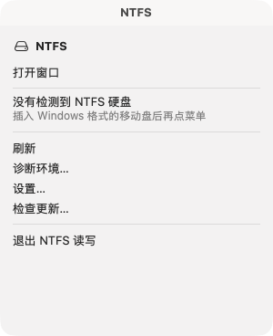
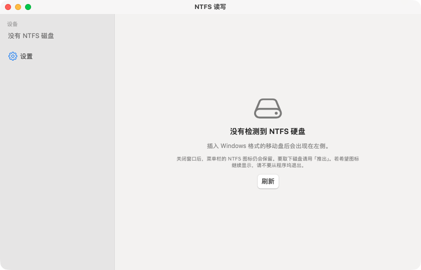
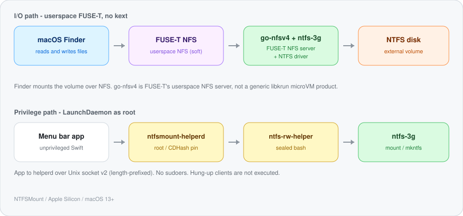

# NTFSMount

**English** · [简体中文](./README_ZH.md)

Writable **external NTFS** on Apple Silicon Macs. **No kext, no SIP change.** macOS 13+ only; Intel is not supported.

`Apple Silicon` · `macOS 13+` · `Writable NTFS` · `No kext` · `Personal-use pre-release`

The UI follows the system language (English / 简体中文 / 繁體中文 / 日本語).

**[Download NTFSMount v1.2.1 (DMG)](https://github.com/bio-apple/NTFSMount/releases/download/v1.2.1/NTFSMount.dmg)** · [Releases & SHA256](https://github.com/bio-apple/NTFSMount/releases/tag/v1.2.1) — use this page, not GitHub **Latest**, not third-party mirrors.

- **Back up first.** Writable NTFS or format can destroy data. Insofar as applicable law allows, the authors are not liable for loss.
- **Not notarized (ad-hoc).** macOS may block the app until you Control-click → Open (Quick Start).
- **Personal use.** Bundled FUSE-T `go-nfsv4` is **not GPL**. Do not ship, sell, or mirror until you have a **written** [FUSE-T](https://www.fuse-t.org/) license **and** Developer ID notarization. Swift / ntfs-3g source is GPL-2.0-or-later; see [NOTICE](./NOTICE).

## Quick Start

1. Download **[NTFSMount.dmg](https://github.com/bio-apple/NTFSMount/releases/download/v1.2.1/NTFSMount.dmg)** from the v1.2.1 GitHub pre-release.
2. Drag **NTFSMount** into Applications. Un-notarized build: **Control-click → Open**, or **System Settings → Privacy & Security → Open Anyway**.
3. First launch: Return = **Agree and Continue**, then **Install…** (admin password on this ad-hoc build).
4. Optional (from a clone of this repo): `./scripts/ntfsmount diagnose`
5. Plug in an external NTFS disk. Menu bar **NTFS** → the volume → **Mount Writable**.

Daily use is the menu bar. The CLI (`ntfsmount mount diskNsM`) needs root and the installed helper; see [FAQ](#faq).

## Features

- Writable access to **external** NTFS disks (userspace FUSE-T, **no kext**)
- Hover the menu-bar **NTFS** icon for volume name, `NTFS • RW|RO`, device id, and used/size
- **Eject (Safe to Unplug)** releases FUSE first, then waits until the volume disappears
- Erase a whole external disk as NTFS from the **root menu** (not a per-volume submenu); Return defaults to **Cancel**
- Four locales: English, 简体中文, 繁體中文, 日本語

## Screenshots

**Menu bar**



**Mounted window**



## Requirements

- **Apple Silicon** Mac (Intel is not supported; scripts exit immediately)
- **macOS 13.0** or later
- An **external** NTFS disk

## Install

1. Download the v1.2.1 DMG and check `shasum -a 256 NTFSMount.dmg` against the [release notes](https://github.com/bio-apple/NTFSMount/releases/tag/v1.2.1).
2. Drag to Applications and open as in [Quick Start](#quick-start).
3. Install the mount helper when asked. Remove it later from **Settings**. Full uninstall: `./uninstall.sh` (does not remove a FUSE-T / MacFUSE copy you installed yourself).

This project is not a Homebrew tap or cask. There is no `brew tap bio-apple/ntfsmount`. NOTICE forbids third-party mirrors of the bundled `go-nfsv4` binary.

## Usage

Closing the window does **not** quit; Quit from the Dock or the menu does.

```text
Menu bar "NTFS"
├ Open Window
├ status · name · size     ← hover the icon for a four-line card
│   ├ Mount Writable / Open in Finder
│   └ Unmount / Eject (Safe to Unplug)
├ Mount All Writable
├ Erase whole disk as NTFS…   ← root menu, not a volume submenu; Return = Cancel
├ Refresh / Diagnose… / Settings… / Check for Updates…
└ Quit NTFS Read-Write
```

Format is **whole external disks** only: type the current volume name; Return defaults to **Cancel**.

| Status | What to do |
| --- | --- |
| Writable | Use it |
| Read-only · system NTFS | Volume is clean; switch to writable from the submenu |
| Read-only · hibernate / unclean | Shut down Windows fully. Do not force writable |

## FAQ

**Won’t open?** See [Quick Start](#quick-start) (Control-click → Open). Last resort:

```bash
xattr -d com.apple.quarantine /Applications/NTFSMount.app
open /Applications/NTFSMount.app
```

**No NTFS extra?** Apple Silicon + macOS 13+ only.

**Install looks wrong?** Menu **Diagnose Environment…** (no mount, no helper install), or `./scripts/ntfsmount diagnose`. This app does not need macFUSE.

**Always asked for an admin password?** Expected on un-notarized builds. Notarized builds prefer `SMAppService`.

**Read-only?** System NTFS can switch to writable if clean. Dirty volumes: **Try to Repair Dirty Volume…** (may drop unsynced Windows cache; Cancel is default). Hibernated / Fast Startup: fully shut down Windows; this app never silently deletes `hiberfil.sys`.

**No Latest asset?** Intentional. Use the pre-release DMG.

**Updates?** Menu **Check for Updates…** talks to GitHub (US). Settings auto-check is **off by default**. Trust is Sparkle EdDSA, not Developer ID. See [docs/SPARKLE.md](./docs/SPARKLE.md).

**Disable SIP or install macFUSE?** No. This app uses **FUSE-T** (userspace) + ntfs-3g. Dev check: `./scripts/check-fuse-deps.sh`. Do not `brew install macfuse` or `brew install fuse-t`.

**CLI mount?** Power users only, after the helper is installed:

```bash
./scripts/ntfsmount list
sudo ./scripts/ntfsmount mount diskNsM
```

`mount` / `unmount` need **root** and the helper. Prefer the menu bar.

**Filing a bug?** `./scripts/ntfsmount diagnose` or `--json`. Volume JSON: `list --json` / `status diskNsM --json`.

More: [docs/MANUAL_TEST.md](./docs/MANUAL_TEST.md).

## Architecture

Finder talks to the disk through FUSE-T’s userspace NFS server (`go-nfsv4`), then ntfs-3g. The menu-bar app stays unprivileged; mount / unmount / format go over a Unix socket to a LaunchDaemon.



| Piece | Role |
| --- | --- |
| App | Lists volumes, confirms format, settings |
| `ntfsmount-helperd` | Pins the caller by **CDHash + bundle id + path** |
| `ntfs-rw-helper` | In-repo bash; runs `ntfs-3g` / `mkntfs` (`HELPER_VERSION=9`) |
| ntfs-3g + FUSE-T | Userspace R/W, **no kext**. `go-nfsv4` is FUSE-T’s NFS server, not a generic libkrun microVM product |

IPC is length-prefixed **v2** (v1 fallback). Format/fix wait up to 10 minutes with heartbeats. The UI runs one privileged command at a time; a hung-up client is not executed. Nothing is written to `sudoers`.

## Limitations

- Always-on auto-mount is **not** a selling point ([#1](https://github.com/bio-apple/NTFSMount/issues/1)). After plugging in a disk, use **Mount Writable**.
- Not on the Mac App Store.
- No Homebrew tap or cask (GPL + bundled FUSE-T `go-nfsv4` + un-notarized; [NOTICE](./NOTICE) forbids mirrors).
- Bundled `go-nfsv4` is personal-use by default. GitHub Releases stay pre-release until a written FUSE-T license **and** Developer ID notarization.

## Security

- No `sudoers` drop-in. Privilege is a one-time LaunchDaemon.
- Helper authenticates the caller by stored **CDHash**, bundle id, and path.
- Privileged work is serialized from the app (`busyId`); disconnected clients are not executed.
- Format and dirty-fix dialogs default to **Cancel** (Return does not confirm).
- Never silently deletes `hiberfil.sys`.
- Sparkle auto-check is **off** by default; checks hit **GitHub (US)**, not an author-operated server. See [docs/SPARKLE.md](./docs/SPARKLE.md) and [NOTICE](./NOTICE).

## Develop

```bash
./scripts/check-fuse-deps.sh
./scripts/ci-shellcheck.sh
./scripts/prepare-runtime.sh
swift test && ./scripts/test-helper.sh
./scripts/coverage.sh          # optional Core line coverage
./scripts/ntfsmount diagnose --json
./scripts/build.sh && ./scripts/package-dmg.sh
```

Build-time: Homebrew `ntfs-3g` + **FUSE-T 1.2.7** official pkg. Pins: [runtime/versions.txt](./runtime/versions.txt). Intel builds are refused.

CI: SwiftLint, ShellCheck, helper selftest, `swift test`, security greps, arm64 build. Optional real-disk job: `.github/workflows/manual-disk-test.yml`.

A `v*` tag packages a DMG Release. Without Developer ID secrets it stays an un-notarized **pre-release**. Do not point Latest at an unlicensed build.

## License

This repo’s Swift and ntfs-3g are GPL-2.0-or-later ([LICENSE](./LICENSE)). `go-nfsv4` is **excluded** from that GPL grant. Split and redistribution rules: [NOTICE](./NOTICE), [docs/DISTRIBUTION.md](./docs/DISTRIBUTION.md).
