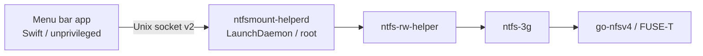

# NTFSMount

**English** · [简体中文](./README_ZH.md)

Writable **external NTFS** on Apple Silicon Macs. **No kext, no SIP change.** macOS 13+ only; Intel is not supported.

`Apple Silicon` · `macOS 13+` · `Writable NTFS` · `No kext` · `Personal-use pre-release`

The UI follows the system language (English / 简体中文 / 繁體中文 / 日本語).


**[Download NTFSMount v1.2.1 (DMG)](https://github.com/bio-apple/NTFSMount/releases/download/v1.2.1/NTFSMount.dmg)** · [Releases & SHA256](https://github.com/bio-apple/NTFSMount/releases/tag/v1.2.1) — use this page, not GitHub **Latest**, not third-party mirrors.

- **Back up first.** Writable NTFS or format can destroy data. Insofar as applicable law allows, the authors are not liable for loss.
- **Not notarized (ad-hoc).** If macOS blocks it: Control-click → Open, or **System Settings → Privacy & Security → Open Anyway**.
- **Personal use.** Bundled FUSE-T `go-nfsv4` is **not GPL**. Do not ship, sell, or mirror until you have a **written** [FUSE-T](https://www.fuse-t.org/) license **and** Developer ID notarization. Swift / ntfs-3g source is GPL-2.0-or-later; see [NOTICE](./NOTICE).

Hover the menu-bar **NTFS** icon for volume name, `NTFS • RW|RO`, device id, and used/size — no need to open the window. Closing the window does **not** quit; Quit from the Dock does. After plugging in a disk, use the submenu **Mount Writable**. Always-on auto-mount is **not** a selling point ([#1](https://github.com/bio-apple/NTFSMount/issues/1)).

## Use

1. Download the DMG and check `shasum -a 256 NTFSMount.dmg` against the [v1.2.1](https://github.com/bio-apple/NTFSMount/releases/tag/v1.2.1) notes.
2. Drag to Applications. Gatekeeper: Control-click → Open, or Open Anyway.
3. First launch: Return = **Agree and Continue**, Esc = **Quit**. Then **Install…** (admin password on this ad-hoc build).
4. Plug in an external NTFS disk. When finished, **Eject (Safe to Unplug)** (releases FUSE first) and wait until the volume disappears.

```text
Menu bar "NTFS"
├ Open Window
├ status · name · size     ← hover the icon for a four-line card
│   ├ Mount Writable / Open in Finder
│   └ Unmount / Eject (Safe to Unplug)
├ Mount All Writable       ← same health prompts as a single mount
├ Erase whole disk as NTFS…   ← root menu only; Return = Cancel
├ Refresh / Diagnose… / Settings… / Check for Updates…
└ Quit NTFS Read-Write
```


| Status | What to do |
| --- | --- |
| Writable | Use it |
| Read-only · system NTFS | Volume is clean; switch to writable from the submenu |
| Read-only · hibernate / unclean | Shut down Windows fully. Do not force writable |

Format is **whole external disks** only: type the current volume name; Return defaults to **Cancel**.  
Uninstall helper: **Settings**. Full uninstall: `./uninstall.sh` (does not remove a system FUSE-T / MacFUSE install).

## Troubleshooting

**Won’t open?** Control-click → Open, or Privacy & Security → Open Anyway. Last resort:

```bash
xattr -d com.apple.quarantine /Applications/NTFSMount.app
open /Applications/NTFSMount.app
```

**No NTFS extra?** Apple Silicon + macOS 13+ only. Closing the window keeps the icon; quitting from the Dock does not.

**Install looks wrong?** Menu **Diagnose Environment…** opens a scrollable report (no mount, no helper install). This app does not need macFUSE.

**Always asked for an admin password?** Expected on un-notarized builds. Notarized builds prefer `SMAppService`.

**Read-only?** System NTFS can switch to writable if clean. Dirty volumes: **Try to Repair Dirty Volume…** (may drop unsynced Windows cache; Cancel is default). Hibernated / Fast Startup: fully shut down Windows; this app never silently deletes `hiberfil.sys`.

**No Latest asset?** Intentional. Use the pre-release DMG on the Releases page.

**Updates?** Menu **Check for Updates…** talks to GitHub. Settings auto-check is **off by default**. Trust is Sparkle EdDSA, not Developer ID. See [docs/SPARKLE.md](./docs/SPARKLE.md).

**Disable SIP or install macFUSE?** No. This app uses **FUSE-T** (userspace) + ntfs-3g. Dev check: `./scripts/check-fuse-deps.sh` (do not `brew install macfuse` or `brew install fuse-t`).

**Intel Mac?** Unsupported. Scripts exit immediately.

**Filing a bug?** `./scripts/ntfsmount diagnose` or `--json`. Volume JSON: `list --json` / `status diskNsM --json`. `mount` / `unmount --json` need root and the installed helper.

More: [docs/MANUAL_TEST.md](./docs/MANUAL_TEST.md). License: [NOTICE](./NOTICE), [docs/DISTRIBUTION.md](./docs/DISTRIBUTION.md).

## Architecture

The menu-bar app is unprivileged. Mount / unmount / format go to a one-time LaunchDaemon over a Unix socket. Nothing is written to `sudoers`. Helper IPC is length-prefixed **v2** (v1 fallback); format/fix wait up to 10 minutes with heartbeats; only one privileged command runs at a time; a hung-up client is not executed.


```mermaid
flowchart LR
  App["Menu bar app<br/>Swift / unprivileged"] -->|Unix socket v2| D["ntfsmount-helperd<br/>LaunchDaemon / root"]
  D --> H["ntfs-rw-helper"]
  H --> N["ntfs-3g"]
  N --> F["go-nfsv4 / FUSE-T"]
```

| Piece | Role |
| --- | --- |
| App | Lists volumes, confirms format, settings |
| `ntfsmount-helperd` | Pins the caller by **CDHash + bundle id + path** |
| `ntfs-rw-helper` | In-repo bash; runs `ntfs-3g` / `mkntfs` (`HELPER_VERSION=9`) |
| ntfs-3g + FUSE-T | Userspace R/W, **no kext** |

## Develop

```bash
./scripts/check-fuse-deps.sh
./scripts/ci-shellcheck.sh
./scripts/prepare-runtime.sh
swift test && ./scripts/test-helper.sh
./scripts/coverage.sh          # optional Core line coverage
./scripts/ntfsmount diagnose --json
./scripts/build.sh && ./scripts/package-dmg.sh
```

Homebrew `ntfs-3g` + **FUSE-T 1.2.7** official pkg. Do not `brew install macfuse` or `brew install fuse-t`. Pins: [runtime/versions.txt](./runtime/versions.txt). Intel builds are refused.

CI: SwiftLint, ShellCheck, helper selftest, `swift test`, security greps, arm64 build. Optional real-disk job: `.github/workflows/manual-disk-test.yml`.

A `v*` tag packages a DMG Release. Without Developer ID secrets it stays an un-notarized **pre-release**. Do not point Latest at an unlicensed build.

This repo’s Swift and ntfs-3g are GPL-2.0-or-later ([LICENSE](./LICENSE)). `go-nfsv4` is **excluded** from that GPL grant.
