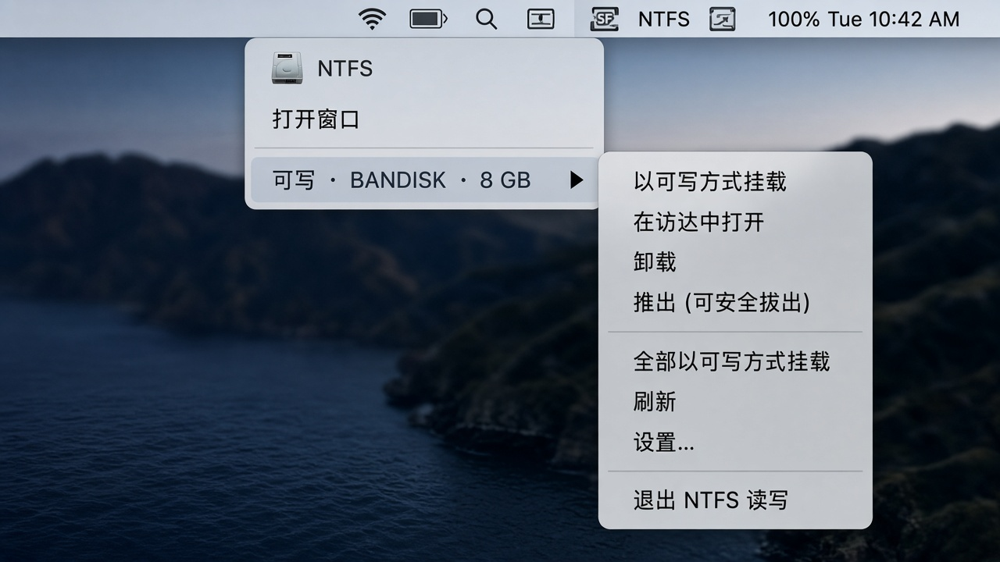
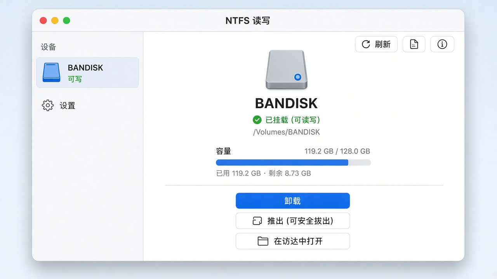
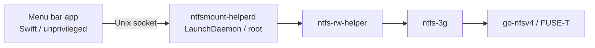

# NTFSMount

[Download](https://github.com/bio-apple/NTFSMount/releases) · [简体中文](./README.md)

**Do not use GitHub Latest. Do not mirror.** Download the pre-release `NTFSMount.dmg` from [Releases](https://github.com/bio-apple/NTFSMount/releases) and check the SHA256 in the notes.

**Distribution scope: personal use only — not a redistributable product.** Bundled FUSE-T `go-nfsv4` is not GPL. Until you have a **written** [FUSE-T](https://www.fuse-t.org/) license **and** Developer ID notarization, do not ship this as a product, list it in a store, sell it, or mirror the DMG. Source (Swift / ntfs-3g) remains GPL-2.0-or-later. See [NOTICE](./NOTICE).

**Disclaimer.** Mounting NTFS writable or formatting it can corrupt or destroy data. Back up important files yourself before you read, write, or format. The authors and this project are not responsible for data loss.

Writable **external NTFS** on Mac, without kernel extensions. **Apple Silicon + macOS 13+ only.** Intel Macs (x86_64) are not supported.

The in-app UI is Simplified Chinese. Button labels below match what you see on screen.

## Use

1. Download the DMG and check `shasum -a 256 NTFSMount.dmg` against the Release notes.
2. Drag it to Applications. If Gatekeeper blocks it: Control-click → Open, or **System Settings → Privacy & Security → Open Anyway**. If it is still quarantined:
   ```bash
   xattr -d com.apple.quarantine /Applications/NTFSMount.app
   ```
3. On first launch, Return is **同意并继续** (Agree and continue); Esc is **退出** (Quit). Then click **安装…** in the window (admin password).
4. Plug in an external NTFS disk and use it in Finder. When finished, click **推出（可安全拔出）** (it releases the FUSE mount first so Finder will not say the disk is in use) and wait until the volume disappears before unplugging.

The menu bar extra **NTFS** appears on the right (screenshot below). Submenus cover mount / unmount / eject, or **打开窗口**. Auto-mount and the helper are in **设置**. Internal disks are never auto-mounted.

```text
Menu bar "NTFS"
├ 打开窗口          Open window
├ 可写 · name · size   one submenu per NTFS volume
│   ├ 以可写方式挂载
│   ├ 在访达中打开
│   ├ 卸载 / 推出（可安全拔出）
│   └ 格式化为 NTFS…
├ 全部以可写方式挂载
├ 刷新 / 设置…
└ 退出 NTFS 读写
```





| Status | What to do |
| --- | --- |
| 可写 (writable) | Use it |
| 只读 · 系统 NTFS | Volume is clean; switch to writable from the submenu |
| 只读 · 休眠/未正常关机 | Shut down Windows fully first. Do not force writable |

Format is whole external disks only: type the current volume name; Return defaults to **取消** (Cancel).  
Uninstall the helper: **设置**. Full uninstall (app, helper, LaunchDaemons, and config): `./uninstall.sh` (does not remove a system-wide FUSE-T / MacFUSE install).

## Troubleshooting

**App will not open?** Un-notarized builds are quarantined. Control-click → Open, or Privacy & Security → Open Anyway. Still stuck:

```bash
xattr -d com.apple.quarantine /Applications/NTFSMount.app
open /Applications/NTFSMount.app
```

**No NTFS extra in the menu bar?** Apple Silicon + macOS 13+ only. Check that you did not quit from the Dock or the window. Clear quarantine with `xattr` and open again.

**Always asked for an admin password?** Expected on un-notarized builds (`SMAppService` is unstable). Notarized builds prefer the system service.

**Volume is read-only?** 「系统 NTFS」can be switched to writable from the submenu if the volume is clean. 「休眠/未正常关机」: dirty volumes can use **尝试修复脏卷** (may drop unsynced Windows cache — back up first; Cancel is the default). If Windows is hibernated / Fast Startup (hiberfil), fully shut down Windows and retry; do not force writable.

**No Latest asset?** Intentional. Use the pre-release DMG on the Releases page, not Latest.

**Intel Mac?** Unsupported. Build scripts exit immediately. Do not install.

**Filing a bug?** Run the read-only dump first (no mount, no admin password, no helper install): `./scripts/ntfsmount diagnose` or `./scripts/ntfsmount diagnose --json`.

**Uninstall left files?** `./uninstall.sh` removes this app, its helper, LaunchDaemons, and config. System FUSE-T / MacFUSE and `/usr/local/lib/libfuse.2.dylib` are yours to remove.

More: [docs/MANUAL_TEST.md](./docs/MANUAL_TEST.md). License boundary: [NOTICE](./NOTICE), [docs/DISTRIBUTION.md](./docs/DISTRIBUTION.md).

## Architecture

Mount, unmount, and format need root. The menu bar app stays unprivileged and sends those operations to a LaunchDaemon you install once (the in-app **助手**). After that there is no admin prompt and nothing is written to `sudoers`.



| Piece | Role |
| --- | --- |
| App | Lists volumes, confirms format, settings; sends `mount` / `unmount` / `eject` / `format` over the socket |
| `ntfsmount-helperd` | System daemon; pins the caller by **CDHash + bundle id + executable path**; rejects everyone else |
| `ntfs-rw-helper` | Bundled bash; actually runs `ntfs-3g` / `mkntfs` (in-repo source, not a third-party blob) |
| ntfs-3g + FUSE-T | Userspace R/W for external NTFS, **no kext**. `go-nfsv4` ships inside the app |

On ad-hoc / not-notarized builds, `SMAppService` usually fails and the same daemon is installed with an admin password. **卸载助手** in Settings removes only the daemon; `./uninstall.sh` deletes the app, daemons, and config.

## Develop

```bash
./scripts/prepare-runtime.sh   # fetch FUSE-T pkg / Homebrew ntfs-3g and verify SHA256
swift test && ./scripts/test-helper.sh
./scripts/coverage.sh          # optional: NTFSMountCore line coverage
./scripts/ntfsmount diagnose           # read-only dump for bug reports / CI; add --json
./scripts/build.sh && ./scripts/package-dmg.sh
```

Dependencies: Homebrew + `brew install ntfs-3g`; **FUSE-T 1.2.7** official pkg ([GitHub Releases](https://github.com/macos-fuse-t/fuse-t/releases/tag/1.2.7), not Homebrew — proprietary, do not `brew install fuse-t`). `prepare-runtime.sh` will `brew install` ntfs-3g if missing; it does **not** silently install FUSE-T into the system (it downloads the pinned 1.2.7 pkg and extracts binaries). **You do not need to launch FUSE-T.app.** A local FUSE-T install other than 1.2.7 is refused. Commands and search paths are printed by the script; pin: [runtime/versions.txt](./runtime/versions.txt).

`prepare-runtime.sh` / `build.sh` exit immediately on Intel Macs. Do not build or install on x86_64.

PRs run SwiftLint / UnitTest / Security Scan / Build (see `.github/workflows/build.yml`). Optional real-disk job: manually trigger `.github/workflows/manual-disk-test.yml` (self-hosted Apple Silicon).

[](https://github.com/bio-apple/NTFSMount) [](https://github.com/bio-apple/NTFSMount)

`Tests/NTFSMountCoreTests` uses a MockCatalog; no real disk. Measured 2026-09-23 with `swift test --enable-code-coverage` (11 cases). **Does not** include SwiftUI or `ntfs-rw-helper` (bash; covered by `test-helper.sh` / `selftest`). `LiveDiskCatalog` calls diskutil (0% line coverage).

| Logic | File | Line coverage |
| --- | --- | --- |
| Disk detection | `NTFSVolume.swift` | 74% |
| Format (which disks may be erased) | `FormatDisk.swift` | 69% |
| Format (exact volume name / Cancel default) | `FormatPolicy.swift` | 91% |
| Mount classification (dirty / system RO / kext) | `VolumeHealth.swift` | 82% |
| NTFSMountCore total | above + copy / errors / live I/O | 63% |
| Total excluding LiveDiskCatalog | | 75% |

Known-good runtime (full pin: [runtime/versions.txt](./runtime/versions.txt), hashes: [runtime/SHA256SUMS](./runtime/SHA256SUMS)):

| Component | Version | Source |
| --- | --- | --- |
| FUSE-T | 1.2.7 | [GitHub Releases](https://github.com/macos-fuse-t/fuse-t/releases/tag/1.2.7) |
| go-nfsv4 | 1.2.7 | `go-nfsv4-1.2.7` inside that pkg |
| libfuse.2 | 2.9.9 | same pkg |
| ntfs-3g / mkntfs / ntfsfix | 2026.7.7 | Homebrew `ntfs-3g` |

Large binaries under `runtime/` are not in git (`.gitignore`; Git LFS if force-added).

Real-disk steps: [docs/MANUAL_TEST.md](./docs/MANUAL_TEST.md). Notarization and shipping: [docs/DISTRIBUTION.md](./docs/DISTRIBUTION.md).

Push a `v*` tag to run GitHub Actions: it packages a DMG and creates a Release. Notarization runs only if Developer ID + App Store Connect API Key secrets are set; otherwise the Release stays an un-notarized pre-release. Do not point Latest at an unlicensed build.

This repo’s Swift and ntfs-3g are GPL-2.0-or-later ([LICENSE](./LICENSE)). `go-nfsv4` cannot be redistributed under the GPL.
