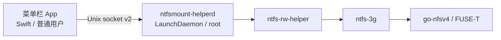

# NTFS 读写 · NTFSMount

[English](./README.md) · **简体中文**

给 Apple Silicon Mac 上的**外置 NTFS** 可写访问。**无 kext、不用关 SIP。** 仅 macOS 13+；不支持 Intel。

`Apple Silicon` · `macOS 13+` · `NTFS 可写` · `无 kext` · `个人使用预发布`

界面跟随系统语言（English / 简体中文 / 繁體中文 / 日本語）。


**[下载 NTFSMount v1.2.1（DMG）](https://github.com/bio-apple/NTFSMount/releases/download/v1.2.1/NTFSMount.dmg)** · [Releases 与 SHA256](https://github.com/bio-apple/NTFSMount/releases/tag/v1.2.1) — 用这一页，不要用 GitHub **Latest**，不要第三方镜像。

- **先备份。** 可写挂载或格式化可能损坏数据。在适用法律允许的范围内，作者不对数据损失负责。
- **未公证（ad-hoc）。** 打不开时：Control-click → 打开，或「系统设置 → 隐私与安全性 → 仍要打开」。
- **个人使用。** 捆绑的 FUSE-T `go-nfsv4` **不是 GPL**。上架、销售或镜像前须取得 [FUSE-T](https://www.fuse-t.org/) **书面许可并完成** Developer ID 公证。Swift / ntfs-3g 源码为 GPL-2.0-or-later，见 [NOTICE](./NOTICE)。

悬停菜单栏 **NTFS** 图标即可看到卷名、`NTFS • 可写/只读`、设备号和用量，不必打开窗口。关窗不会退出；从程序坞退出才会。插入磁盘后用子菜单「以可写方式挂载」。全盘自动挂载**不是**卖点（[#1](https://github.com/bio-apple/NTFSMount/issues/1)）。

## 使用

1. 下载 DMG，用 `shasum -a 256 NTFSMount.dmg` 对照 [v1.2.1](https://github.com/bio-apple/NTFSMount/releases/tag/v1.2.1) 正文。
2. 拖入「应用程序」。Gatekeeper：Control-click → 打开，或「仍要打开」。
3. 首次启动：回车 = **同意并继续**，Esc = **退出**。再点 **安装…**（本包会要管理员密码）。
4. 插入外置 NTFS。用完点 **推出（可安全拔出）**（会先释放 FUSE），等盘消失再拔线。

```text
菜单栏「NTFS」
├ 打开窗口
├ 状态 · 盘名 · 容量     ← 悬停图标有四行卡片
│   ├ 以可写方式挂载 / 在访达中打开
│   └ 卸载 / 推出（可安全拔出）
├ 全部以可写方式挂载     ← 与单盘相同的健康确认
├ 抹掉整盘为 NTFS…       ← 只在根菜单；回车默认取消
├ 刷新 / 诊断环境… / 设置… / 检查更新…
└ 退出 NTFS 读写
```


| 状态 | 做什么 |
| --- | --- |
| 可写 | 直接用 |
| 只读 · 系统 NTFS | 卷干净时，子菜单改成可写 |
| 只读 · 休眠/未正常关机 | 先在 Windows 彻底关机，不要强行可写 |

格式化只对外置**整盘**：输入当前卷名，回车默认 **取消**。  
卸载助手：设置。完全卸载：`./uninstall.sh`（不删系统里另装的 FUSE-T / MacFUSE）。

## 故障排除

**打不开？** Control-click → 打开，或「隐私与安全性 → 仍要打开」。仍不行：

```bash
xattr -d com.apple.quarantine /Applications/NTFSMount.app
open /Applications/NTFSMount.app
```

**菜单栏没有 NTFS？** 仅 Apple Silicon + macOS 13+。关窗图标还在；从程序坞退出就没了。

**安装环境不对？** 菜单「诊断环境…」打开可滚动报告（不挂载、不装助手）。不需要 macFUSE。

**一直要管理员密码？** 未公证包的预期行为。公证后才优先系统服务。

**盘是只读？** 系统 NTFS 可在卷干净时改可写。脏卷：「尝试修复脏卷…」（可能丢失未写入的 Windows 缓存；默认取消）。休眠/快速启动：彻底关机后再试；本应用不会静默删除 `hiberfil.sys`。

**没有 Latest？** 故意的。用 Releases 里的 pre-release DMG。

**怎么更新？** 菜单「检查更新…」会访问 GitHub。设置里自动检查**默认关**。信任来自 Sparkle EdDSA，不是 Developer ID。见 [docs/SPARKLE.md](./docs/SPARKLE.md)。

**要关 SIP 或装 macFUSE 吗？** 不要。本应用用 **FUSE-T**（用户态）+ ntfs-3g。开发机：`./scripts/check-fuse-deps.sh`（不要 `brew install macfuse` 或 `brew install fuse-t`）。

**Intel Mac？** 不支持。脚本会立刻退出。

**提交 Bug？** `./scripts/ntfsmount diagnose` 或 `--json`。卷 JSON：`list --json` / `status diskNsM --json`。`mount` / `unmount --json` 需要 root 与已装助手。

更多：[docs/MANUAL_TEST.md](./docs/MANUAL_TEST.md)。许可：[NOTICE](./NOTICE)、[docs/DISTRIBUTION.md](./docs/DISTRIBUTION.md)。

## 架构

菜单栏 App 保持普通用户权限。挂载 / 卸载 / 格式化经 Unix socket 交给一次性安装的 LaunchDaemon。不写 `sudoers`。Helper IPC 为长度前缀 **v2**（可回退 v1）；format/fix 最长等待 10 分钟并带心跳；特权命令串行；客户端已断开则不执行。



| 组件 | 做什么 |
| --- | --- |
| App | 列卷、确认格式化、设置 |
| `ntfsmount-helperd` | 用调用方 **CDHash + bundle id + 路径** 钉扎 |
| `ntfs-rw-helper` | 仓库内 bash；跑 `ntfs-3g` / `mkntfs`（`HELPER_VERSION=9`） |
| ntfs-3g + FUSE-T | 用户态读写，**不用 kext** |

## 开发

```bash
./scripts/check-fuse-deps.sh
./scripts/ci-shellcheck.sh
./scripts/prepare-runtime.sh
swift test && ./scripts/test-helper.sh
./scripts/coverage.sh
./scripts/ntfsmount diagnose --json
./scripts/build.sh && ./scripts/package-dmg.sh
```

Homebrew `ntfs-3g` + **FUSE-T 1.2.7** 官方 pkg。不要 `brew install macfuse` 或 `brew install fuse-t`。钉死版本：[runtime/versions.txt](./runtime/versions.txt)。Intel 构建会被拒绝。

CI：SwiftLint、ShellCheck、helper selftest、`swift test`、安全 grep、arm64 构建。真盘可选：`.github/workflows/manual-disk-test.yml`。

推送 `v*` tag 会打 DMG Release。没有 Developer ID 凭据时仍是未公证 **pre-release**。不要把 Latest 指到未授权包。

本仓库 Swift 与 ntfs-3g 为 GPL-2.0-or-later（[LICENSE](./LICENSE)）。`go-nfsv4` **不在**该 GPL 授权范围内。
